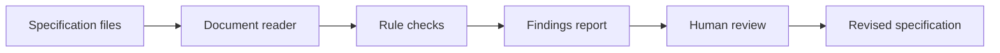

# Spec Lint

**A clear, deterministic checker for incomplete and difficult-to-test software specifications.**

> [!NOTE]
> Spec Lint is in the foundation phase. Rules and output formats are being designed; no stable command-line release is available yet.

## About

Spec Lint is planned as a checker for software requirement documents. It will identify missing actors, undefined terms, weak acceptance criteria, contradictory constraints, incomplete error behavior, and other issues that make implementation and review harder.

It will report findings with rule identifiers and locations. It will not silently rewrite a specification or claim that a passing document guarantees product success.

## Planned checks

| Category | Example finding |
|---|---|
| Scope | Goal or non-goal is missing. |
| Actors | A feature has no defined user or system actor. |
| Acceptance | A requirement cannot be verified from its wording. |
| Errors | Failure behavior is omitted. |
| Data | Required fields or missing-value behavior are unclear. |
| Interfaces | Input, output, or compatibility assumptions are unspecified. |
| Quality | Performance, accessibility, or reliability expectations are absent. |
| Consistency | Terms or constraints conflict across sections. |

## Planned workflow

## Planned output

- Human-readable terminal report.
- JSON report for other tools.
- Markdown review summary.
- Rule documentation with examples and severity guidance.
- Configuration for selecting rules and severity levels.

## Design principles

- Deterministic results for the same version and input.
- Clear locations and explanations for every finding.
- Separate missing information from style preferences.
- Support gradual adoption through configurable rule sets.
- Keep the core usable without a paid service.

## Project status

| Workstream | State |
|---|---|
| Rule taxonomy | Active |
| Document reader | Planned |
| Rule engine | Planned |
| Report formats | Planned |
| Editor integration | Future |

## Roadmap summary

1. Publish the rule taxonomy and test fixtures.
2. Implement Markdown section reading.
3. Add the first deterministic rules and JSON report.
4. Add configuration and repository checks.
5. Publish a preview command-line release.

See [ABOUT.md](ABOUT.md) for positioning and repository metadata.

## License

The license will be finalized before the first executable release.